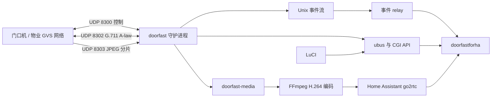

# Doorfast

Doorfast 是面向 x86_64 ImmortalWrt 25.12.1 的 GVS 可视门禁适配服务。它提供被动观察、主机模式呼叫与控制、双向音频、视频接收、主动预览、Home Assistant 事件接入，以及现场部署取证工具。

> **文档规则：本 README 是项目能力、配置、接口、验证状态和后续工作的唯一权威文档。** 仓库不再维护并行的计划、设计或进度 Markdown。`docs/` 中可以保留带明确标识的抓包、逆向、来源和验收证据记录，但其中的历史状态与下一步不构成当前项目结论。功能变化必须同时更新本文件；若文档与代码冲突，以已合并代码和可复现测试为准。

> **现场边界：协议报文已成功提交或收到协议确认，不等于门锁、电梯、门口机或物业平台已实际执行。** 本文分别记录代码接线、测试、材料交叉验证和实体设备闭环，禁止用前三者代替实机结论。

本文基于 2026-09-18 对完整代码和测试的复核，覆盖 `src/`、3 个 APK 配方、LuCI、init 脚本、CLI、HTTP/ubus/Unix 接口和 CI。此前“主程序只构造并排队控制报文”的描述已经过时：呼叫、在线维护、开锁、召梯、音频和视频主链路都已接入生产 UDP；尚未完成的实体设备验证见“已知限制和未完成项”。

## 安全和部署前提

- 软件包和主机模式默认关闭。首次安装不会猜测网口、逻辑身份、IP、子网掩码或门禁材料。
- 被动模式只抓包，不给门禁网口绑定室内机 IP；主机模式会临时给指定网口添加室内机 IP，并主动发送 GVS UDP。
- 透明串联桥由管理员提前配置。Doorfast 只检查和观察，不创建桥、不修改路由、防火墙、DHCP 或 RA。
- CGI 控制桥自身不实现 Bearer Token 鉴权，应只允许受信管理网或经 Home Assistant 代理访问，禁止直接暴露到 WAN。
- 厂商材料和 PCAP 是实现依据之一，但可能不完整或不准确。任何主动能力都必须以现场双向抓包和实体结果继续验证。
- 现场串联可能中断原 MT8157。部署时必须保留物理直连回退方案，并先运行只读预检。

## 证据等级

本文的能力矩阵使用以下等级：

| 等级 | 含义 | 能证明什么 |
|---|---|---|
| L1 生产接线 | 功能从主守护进程连接到真实 socket、文件、进程或系统接口 | 运行时会执行该代码路径 |
| L2 测试验证 | 单元、CLI、HTTP、回放或 ImmortalWrt VM 验证通过 | 实现与测试模型一致 |
| L3 材料交叉验证 | 厂商资料、反编译结果或现场 PCAP 支持字段和方向 | 协议推断有外部证据 |
| L4 实机闭环 | 实体门口机、门锁、电梯或物业系统完成端到端动作 | 现场兼容性成立 |

矩阵中的“部分”表示只覆盖了该等级的一部分，不可提升为更高等级。

## 系统结构



单次守护进程运行期间以 `generation` 隔离呼叫、控制和媒体。新来电、抢占、挂断或超时会使旧 generation 的操作失效，避免把旧按钮、旧音频或旧画面提交到新会话。守护进程重启后 generation 会从 1 重新计数；接听、挂断、开锁和召梯同时强制匹配本次运行的 `runtime_id`，防止延迟请求碰撞到重启后的同号 generation。

## 软件包

| APK | 当前版本 | 内容 | 架构 |
|---|---|---|---|
| `doorfast` | `0.1.0-r53` | 守护进程、记录器、事件 relay、PCM HTTP/CLI、CGI 桥、init/UCI、站点清单工具 | x86_64 |
| `doorfast-media` | `0.1.0-r3` | 可选的 ABI v2 `/usr/lib/doorfast/media-v2.so`，由主守护进程 `dlopen()`；不安装独立服务 | x86_64 |
| `luci-app-doorfast` | `0.1.0-r17` | 状态、媒体、站点、自动化、部署、HA relay 和日志页面 | all |

`doorfast-media` 中的 `.so` 是本项目为 ImmortalWrt 编译的原生共享模块，不是 Android APK 内提取的二进制。

GitHub Actions 使用校验过 SHA-256 的官方 ImmortalWrt 25.12.1 x86_64 SDK，依次运行主机测试并构建这 3 个 APK。CI 产物还包含仅用于验收的 `doorfast-pcm-http-acceptance`，该文件不会安装到路由器。

## 当前能力矩阵

| 能力 | 当前实现 | L1 | L2 | L3 | L4 |
|---|---|---:|---:|---:|---:|
| 被动抓包与 VLAN-aware UDP 提取 | 指定物理口、VLAN、bridge 或 bond；失效后有限重试 | 是 | 是 | 是 | 部分 |
| GVS 身份与寻址 | 校验 `IS:楼栋-单元-房间-分机`，推导单播 IP、组播组和室内机 peer | 是 | 是 | 是 | 否 |
| 主机网口生命周期 | 独立主机网口、临时地址添加/删除、UDP 源地址绑定、UDP/8300 组播加入 | 是 | 是 | 是 | 否 |
| 来电 | 解析 `03/01`，建立 generation，发送 `03/81` 回执，处理抢占和超时；当前现场已验证来电送达和 `03/81` 回执，门口机不再显示“无应答” | 是 | 是 | 是 | 部分 |
| 接听 | 发送 `03/03`，跟踪重试和 `03/83` 确认 | 是 | 是 | 是 | 否 |
| 挂断 | 发送 `03/02`，跟踪重试和 `03/82` 确认 | 是 | 是 | 是 | 否 |
| 通话保活 | 发送和接收 `03/51`、`03/52`，维护通话状态 | 是 | 是 | 是 | 否 |
| 直接开锁 | 使用 8 字节门禁材料发送 `04/09`，解析 `04/89` | 是 | 是 | 是 | 否 |
| 手动召梯 | 向上/向下发送 `08/02`，解析 `08/82` | 是 | 是 | 部分 | 否 |
| 自动召梯 | 每个来电 generation 最多自动向上召梯一次；LuCI 可开关，默认关闭 | 是 | 是 | 部分 | 否 |
| 电梯状态 | 周期发送 `08/03`，解析 `08/83` 和轿厢状态 | 是 | 是 | 部分 | 否 |
| 下行音频 | 接收 UDP/8302 G.711 A-law，统计丢包/重复/乱序，发布增量 WAV | 是 | 是 | 是 | 否 |
| 上行音频 | generation 绑定的 PCM 经 A-law 编码，以 8 kHz、160 样本/20 ms 发送 UDP/8302 | 是 | 是 | 是 | 否 |
| 通话视频 | 接收 UDP/8303 JPEG 分片，重组、校验、识别尺寸并发布最新帧 | 是 | 是 | 是 | 否 |
| 主动预览 | 发送 `03/04`，处理 `03/84`/`03/50`，用 `03/02` 停止 | 是 | 是 | 部分 | 否 |
| H.264/WebRTC 前置链路 | JPEG 经 FFmpeg 的 libx264/VAAPI/QSV 发布到预创建的 go2rtc RTSP 流 | 是 | 是 | 不适用 | 不适用 |
| 本地事件流 | `/var/run/doorfast/events.sock` 发布带 event ID 和 generation 的 JSONL | 是 | 是 | 不适用 | 不适用 |
| HA 事件 relay | HTTP/HTTPS、队列、重连、退避、令牌文件和轮询兜底 | 是 | 是 | 不适用 | 不适用 |
| LuCI | 状态/媒体、来电自动化、部署配置、HA relay、内存日志 | 是 | 是 | 不适用 | 不适用 |
| 透明串联取证 | 只读预检、轮转 PCAP、元数据、空间保护、前后站点清单比对 | 是 | 是 | 不适用 | 不适用 |
| 在线 peer 回复 | 收到 `07/01` 后，经事务队列和运行时厂商头发送真实 `07/81` UDP | 是 | 是 | 是 | 否 |
| 周期同步 | 维护者把已配置的厂商同步键按最多 20 项分片发送真实 `91/03` UDP；日志记录实际包数 | 是 | 是 | 是 | 否 |

### 已经接入真实 UDP 的控制路径

下列路径不是只停留在序列化器或内存队列：

- 来电回执 `03/81`。
- 接听 `03/03`、接听确认 `03/83`。
- 挂断 `03/02`、挂断确认 `03/82`。
- 通话握手/保活 `03/51` 和 `03/52`。
- 直接开锁 `04/09`、协议结果 `04/89`。
- 手动和自动召梯 `08/02`、协议确认 `08/82`。
- 电梯状态查询 `08/03`、状态响应 `08/83`。
- G.711 A-law 上行音频 UDP/8302。
- 主动预览请求 `03/04` 和停止 `03/02`。
- 在线 peer 回复 `07/81`。
- 维护者周期同步 `91/03`；只有已填写现场确认值的同步键会进入报文。

所有控制帧使用运行时厂商随机字段/变换字段。普通呼叫、在线回复、开锁和召梯控制优先使用最近 60 秒内观察到的 peer IPv4；表项在 60 秒边界失效，未命中时根据目标逻辑身份推导 IPv4，新报文会刷新路由。主动预览使用独立的 station 路由表：抓包学习的地址同样只在 60 秒内有效，也可使用明确配置的门口机 IP 作为回退。`status` 中的 `physical_result_confirmed` 对开锁和召梯保持为 `false`，因为协议成功不能证明机械动作。

## 安装与启动

将同一次 CI 或 Release 生成的 APK 安装到 ImmortalWrt 25.12.1 x86_64：

```sh
apk add --allow-untrusted ./doorfast.apk ./luci-app-doorfast.apk
# 需要主动 H.264 预览时再安装：
apk add --allow-untrusted ./doorfast-media.apk
```

安装后服务仍保持关闭。通过 LuCI 的“服务 → Doorfast → 部署配置”设置模式和网口，或编辑 `/etc/config/doorfast`，然后执行：

```sh
/etc/init.d/doorfast enable
/etc/init.d/doorfast restart
ubus call doorfast status
```

修改 `doorfast` 或 `doorfast-automation` 后，init reload 会停止旧实例、清理临时主机地址并按新配置启动。

## 配置被动观察

被动模式适合保留原 MT8157，并从镜像口或透明串联接口观察。门禁接口可以继续保持 OpenWrt 的“无协议”状态；Doorfast 不为其绑定室内机 IP。

```uci
config gvs 'main'
	option enabled '1'
	option passive_interface 'eth2'
	option host_interface ''
	option gvs_local_address 'IS:2-1-101-1'
	option passive_only '1'
	option active_host '0'
	option capture_promiscuous '0'
	option sync_state_path '/etc/config/doorfast-sync'
```

`gvs_local_address` 仍是必填项，用于只接纳发给本室内机的帧。`capture_promiscuous` 仅在交换网络和抓包拓扑确实需要时开启。

## 配置主机模式

主机模式用于 Doorfast 取代原 MT8157 的网络身份。它与被动模式使用独立的 `host_interface`，不会沿用被动网口选择。

```uci
config gvs 'main'
	option enabled '1'
	option passive_interface ''
	option host_interface 'eth2'
	option gvs_local_address 'IS:2-1-101-1'
	option indoor_ipaddr ''
	option indoor_netmask '255.255.255.0'
	option uplink_interface 'br-lan'
	option passive_only '0'
	option active_host '1'
	option capture_promiscuous '0'
	option multicast_mode 'auto'
	option multicast_address ''
	option access_material ''
	option sync_mini1_secretkey ''
	option sync_mini2_secretkey ''
	option sync_state_path '/etc/config/doorfast-sync'
```

主机模式规则：

- `gvs_local_address` 必须匹配 `IS:楼栋-单元-房间-分机`。楼栋为 1–99、单元为 1–9、楼层为 1–63、房号为 1–32、分机为 1–4，例如 `IS:2-1-101-1`。
- `indoor_ipaddr` 留空时按 GVS 身份推导；手动填写时覆盖推导值。当前实现不会等待物业系统通过专用配置协议下发 IP。
- `indoor_netmask` 必须按现场原室内机填写。现有材料不足以可靠推导通用掩码，因此不会自动猜测。
- init 脚本把 `IP/掩码` 临时添加到 `host_interface`，守护进程将 UDP sender 绑定到该 IP；停服时删除临时地址。
- `multicast_mode=auto` 按 GVS 身份推导组播地址；`multicast_mode=custom` 只接受 `224.0.0.0/4` 内的明确地址。两种模式都使用 UDP/8300，runner 会同时记录 derived/effective 值。
- `access_material` 是直接开锁报文使用的 8 字节材料，以 16 个十六进制字符填写。留空时开锁控制不可用，不生成默认值。
- `sync_mini1_secretkey` 和 `sync_mini2_secretkey` 是厂商材料确认的两个 Mini 同步键。它们属于站点敏感值，只能填写从原设备或物业配置获得的真实值；留空时不生成替代值，也不会把该键放入周期 `91/03`。
- `uplink_interface` 仅标识可选的管理/上行接口，不改变门禁网口。

当前现场已经完成门口机来电送达与 `03/81` 回执验证，门口机不再显示“无应答”，因此早期故障不再是未解决项。`07/81` peer reply 和 `91/03` 周期同步已经接入生产发送，但新发送路径仍需在现场做冷启动、长时间在线和双向 PCAP 回归；代码接线不能代替物业系统认可的 L4 证据。

## 主动门口机发现

主动发现只在主机模式启用时运行。每次 `station_scan` 触发一个固定的三帧 `07/06` 扫描序列；运行时只接纳目标类型和校验通过的匹配 `07/86` 回复，并在候选缓存中记录逻辑地址、IPv4、首次/最近观察时间和回复次数。候选只用于 LuCI 的人工采用流程，不会自动写入配置。

可用接口如下：

- `ubus call doorfast station_scan '{}'`：安排一次扫描，返回当前 `runtime_id` 和 `scheduled`，不表示已经发现实体设备。
- `ubus call doorfast station_candidates '{}'`：读取候选缓存，候选不会直接出现在 HA 的已配置站点列表中。
- `ubus call doorfast stations '{}'`：读取已配置门口机、`revision`、路由来源和 `route_fresh`；`/api/v1/stations` 只暴露这些已配置条目。

普通 peer 和门口机路由的观察新鲜度为 60 秒。超时条目会标记为失效并阻止主动媒体使用，重新观察或明确配置的门口机地址后才能恢复。扫描、候选读取和站点列表不会修改网络 UCI；`runtime_id` 变化时客户端必须丢弃旧的候选和站点状态。

Task 7 的软件验收可用仓库 fixture 复现：

```sh
python3 -B tests/run_doorfast_vm_stations.py \
  tests/fixtures/fake-vm-preflight-ssh.sh
```

该 runner 只证明一次扫描生命周期的三帧发送结果（fixture 通过 `frames_sent=3` 暴露）、候选与已配置站点数量、ubus 与 `/api/v1/stations` 投影一致、revision、路由新鲜度和组播推导值；输出中的 `physical_registration` 与 `physical_actions` 固定为 `unconfirmed`，不代表物业系统已经注册，也不代表门口机、门锁或电梯已经动作。

## 来电、控制和 generation

`ubus call doorfast status` 是运行状态的权威入口。来电创建 generation；接听、挂断和开锁都要求提交当前 generation。接听、挂断、开锁和召梯还必须提交状态中的 16 位小写十六进制 `runtime_id`，并与当前守护进程运行实例完全一致。召梯操作由服务生成独立 transaction ID。Doorfast 重启后，客户端必须重新读取状态并丢弃旧 runtime 下的 generation 和事件高水位。

常用 ubus 方法：

| 方法 | 参数 | 返回语义 |
|---|---|---|
| `status` | `{}` | 同步、呼叫、开锁、电梯、音频、视频和媒体状态 |
| `logs` | `{}` | 最多 128 条内存日志；重启后清空 |
| `answer` | `runtime_id`、`generation`、`primary_media_port`、`secondary_media_port`、`duration_seconds` | `queued=true` 只表示已进入发送事务 |
| `hangup` | `runtime_id`、`generation`、`reason` | `queued=true` 只表示已进入发送事务 |
| `unlock` | `runtime_id`、`generation` | `submitted=true` 只表示协议事务已提交 |
| `call_elevator` | `runtime_id`、`direction=up|down` | 返回 transaction ID，不宣称电梯已动作 |
| `monitor_start` | `{}` | 返回新的预览 generation 和 `queued` 状态 |
| `monitor_stop` | `generation` | 只停止匹配的预览 |
| `monitor_viewer` | `generation`、`active` | 更新当前 generation 的观看者状态 |
| `monitor_status` | `{}` | 返回媒体模块状态 |
| `media_credentials` | 密码/令牌写入或清除字段 | 保存 root-only 凭据，不回显明文 |

示例：

```sh
status="$(ubus call doorfast status)"
generation="$(printf '%s' "$status" | jsonfilter -e '@.call.generation')"
runtime_id="$(printf '%s' "$status" | jsonfilter -e '@.runtime_id')"

ubus call doorfast answer \
  "{\"runtime_id\":\"$runtime_id\",\"generation\":$generation,\"primary_media_port\":8303,\"secondary_media_port\":8302,\"duration_seconds\":60}"
ubus call doorfast unlock \
  "{\"runtime_id\":\"$runtime_id\",\"generation\":$generation}"
ubus call doorfast call_elevator \
  "{\"runtime_id\":\"$runtime_id\",\"direction\":\"up\"}"
ubus call doorfast hangup \
  "{\"runtime_id\":\"$runtime_id\",\"generation\":$generation,\"reason\":0}"
```

来电自动向上召梯位于 LuCI 的“来电自动化”页，配置保存在 `/etc/config/doorfast-automation`。默认关闭；启用后每个来电 generation 最多提交一次向上召梯。

## HTTP 接口

CGI 基础路径为 `/cgi-bin/doorfast`。下表中的 `GET`/`POST` 是客户端调用约定；PCM 与 monitor 路由会校验 `REQUEST_METHOD`，普通 status、控制及音视频快照路由当前只按路径分派，不能把表中的方法写法当作安全边界。

| 方法和路径 | 用途 |
|---|---|
| `GET /api/v1/status` | 转发 `ubus doorfast status` |
| `POST /api/v1/answer` | 接听；请求 JSON 与 ubus 参数相同 |
| `POST /api/v1/hangup` | 挂断 |
| `POST /api/v1/unlock` | 开锁 |
| `POST /api/v1/call_elevator` | 向上/向下召梯 |
| `GET /api/v1/video/latest.jpg?generation=N` | 当前 generation 的最新 JPEG，支持 ETag |
| `GET /api/v1/audio/latest.wav?generation=N&after=R` | 增量 WAV；`after` 是上一 revision |
| `POST /api/v1/audio/session?runtime=R&generation=N` | 获取独占 PCM producer lease |
| `POST /api/v1/audio/submit.pcm?runtime=R&generation=N&sequence=S` | 提交 1–5 个 320 字节 PCM 帧 |
| `POST /api/v1/audio/session/end?runtime=R&generation=N` | 结束 PCM producer session |
| `POST /api/v1/monitor/start` | 启动主动预览 |
| `POST /api/v1/monitor/stop` | 停止匹配 generation 的预览 |
| `POST /api/v1/monitor/viewer` | 报告观看者进入或离开 |
| `GET /api/v1/monitor/status` | 获取媒体状态 |

PCM 为 little-endian signed 16-bit、单声道、8 kHz；每帧 160 样本/320 字节。session 打开后返回 `audio_session`，后续请求通过 `X-Doorfast-Audio-Session` 传递。lease 为 2 秒，每次成功提交会续期；序号必须连续，部分批次成功会返回已接受前缀和下一序号，调用方应从该位置恢复。

HTTP producer 同一时间只允许一个请求在途。请求超时或失败后必须丢弃该旧请求的完整 body，既不重放已确认的前缀，也不重放未确认的后缀；先按服务返回的 `next_sequence` 对齐，再从新采集的音频继续。`runtime_id` 或 generation 改变时必须立即结束采集并清空本地缓冲。

本地低层入口也可发送单帧：

```sh
# stdin 必须恰好为 320 字节 PCM
doorfast-pcm-submit "$generation" < frame.pcm
```

本地入口是非阻塞 Unix datagram socket `/var/run/doorfast-audio.sock`，每个 datagram 必须恰好 336 字节：偏移 0 是 8 字节 `DFPCM01\0`，偏移 8 是 8 字节 little-endian 非零 generation，偏移 16 是 320 字节 PCM。服务每次调度最多检查 32 个 datagram，并保留消息边界。创建端只删除既有 socket，不会替换普通文件；发送端必须核对目标确为当前有效用户拥有、权限为 `0600` 的 socket。

## 音视频和主动预览

### 通话媒体

- UDP/8302 接收 G.711 A-law，记录 sequence、丢包、重复和迟到包，并保留最近 4 个增量 WAV chunk。
- 本地 `/var/run/doorfast-audio.sock` 只接受当前 talking generation 的 160 样本 PCM，编码后发往已观察到的对端音频路由。
- UDP/8303 只接纳当前 generation 且来源/目标匹配的媒体，完成 JPEG 分片重组、结构校验和尺寸提取。
- 最新 JPEG 默认发布到 `/tmp/doorfast-latest.jpg`；HTTP 读取时再次核对 generation、帧号和长度，避免读取到切换中的文件。

上行 PCM → A-law → UDP/8302 已完成单元和 VM 验证；下行音频与通话视频目前由主机测试、HTTP fixture 和 PCAP 交叉验证覆盖，尚未完成整条 VM 媒体注入。真实扬声器播放、麦克风回声、时延、抖动及长时间稳定性尚未通过实体设备验收。

### 主动预览到 Home Assistant

主动预览要求：

1. 主机模式已启用。
2. 安装 `doorfast-media`。
3. 从抓包或物业设备表获得精确门口机逻辑地址；它不能由室内机 GVS 身份推导。
4. Home Assistant/go2rtc 已预创建与 `media_stream_name` 相同的 RTSP 发布入口。
5. LuCI 中配置 go2rtc 主机、端口、编码器、帧率、码率和凭据。

go2rtc 最小配置示例：

```yaml
streams:
  doorfast_preview:

rtsp:
  listen: ":8554"
  username: doorfast
  password: ${DOORFAST_RTSP_PASSWORD}
  default_query: "video=h264"
```

Doorfast 需要访问 Home Assistant/go2rtc 的 `8554/TCP` 来发布 RTSP；HA WebRTC 查看端通常还需要访问 `8555/TCP+UDP`。go2rtc 的 `1984/TCP` 是管理 API，应保持鉴权并仅限管理网络访问。

运行链路为：发送 `03/04` → 等待 `03/84` → 接收 JPEG → 启动受监督的 FFmpeg → 通过 RTSP/TCP 发布 H.264 → HA 由 go2rtc 提供 WebRTC。来电会先抢占主动预览；停止时发送 `03/02`，处理 `03/82` 或本地超时，并回收 FFmpeg 子进程。

编码器选项：

- `auto`：探测启动环境后一次性选择 Intel QSV，其次 VAAPI，否则选择软件 libx264；已选 FFmpeg 启动失败时不会继续尝试其他编码器。
- `software`：libx264，`veryfast` + `zerolatency`。
- `vaapi`：`h264_vaapi`，使用 `/dev/dri/renderD128`。
- `qsv`：`h264_qsv`。

分辨率支持源尺寸、480x640、360x480 和 240x320；帧率支持 5、8、10、12、15 FPS；目标码率允许 256–2000 Kbps；Profile 支持 Baseline 和 Main。凭据保存在 `/etc/doorfast/media-credentials`，页面不会回显已保存值，修改后需重启 Doorfast 才进入运行模块。

当前 ABI v2 只允许 1 条主动预览来源编码流，多名观看者由 go2rtc 共享该流。下列 LuCI/UCI 选项已传入媒体模块并实际影响运行行为：

- `media_min_free_kib`：发送预览请求前读取 `/proc/meminfo` 的 `MemAvailable`，不足时以 `insufficient_memory` 拒绝启动。
- `media_preview_timeout`：单次预览达到总时限后进入停止状态并发送协议停止请求。
- `media_first_frame_timeout`：门口机确认预览后等待首个 JPEG 帧的超时。

旧配置中的 `media_max_encoders`、`media_overload_policy`、`media_diagnostics` 和 `media_publish_retries` 仍由解析器接受以兼容升级，但不再出现在默认 UCI 或 LuCI 中，也不改变运行行为。FFmpeg 子进程异常退出会让当前预览失败并回收资源，不会宣称已经执行发布重试。请求间隔 1000 ms、最多 3 次请求和停止确认超时 1000 ms 仍为固定协议常量。多来源并发需要未来的多会话 ABI，当前不能描述为可配置多路编码。

## Home Assistant 集成

配套集成位于 [jieinfo/doorfastforha](https://github.com/jieinfo/doorfastforha)。HA 负责展示、交互和下发指令；ImmortalWrt 负责门禁协议、媒体接收、编码和转发。

### 呼叫事件 relay

主守护进程在 `/var/run/doorfast/events.sock` 发布以下 JSONL 事件：

- `incoming_call`
- `call_established`
- `hangup`
- `timeout`
- `preempted`

事件包含 `schema_version=1`、单调递增的 `event_id`、`generation` 和 `timestamp_ms`。socket 最多连接 16 个客户端，每个客户端有 64 条有界队列；慢客户端不会阻塞呼叫主循环。

独立的 `doorfast-event-relay` 负责断线重连、有界队列和指数退避。配置示例：

```uci
config relay 'main'
	option enabled '1'
	option url 'http://homeassistant.local:8123'
	option entry_id '0123456789ABCDEF0123456789ABCDEF'
	option token ''
	option token_file '/etc/doorfast/ha-token'
	option ca_file '/etc/ssl/certs/ca-certificates.crt'
```

`url` 只填写 HTTP/HTTPS authority，可带端口，不填写 `/auth/login_flow` 或其他路径。最终地址固定为 `<url>/api/doorfast/<entry_id>`。HTTP 可用于可信内网；HTTPS 会校验 CA 和主机名。LuCI 中输入长期访问令牌后，init 脚本将其移动到 root 所有且权限不超过 `0600` 的 `token_file`，并从 UCI 删除明文。

事件推送用于降低延迟，HA 状态轮询仍是丢事件和重连后的权威兜底。

媒体不再使用独立的事件 relay。Doorfast 通过现有事件 relay 发布来电、通话和预览状态事件；go2rtc 只负责接收 Doorfast 发布的媒体流并向 Home Assistant 提供 RTSP/WebRTC。媒体配置、RTSP 凭据和编码参数位于独立的 LuCI“媒体预览”页面。

## LuCI 页面

| 页面 | 当前功能 |
|---|---|
| 状态 | 每 5 秒读取 ubus；显示同步、呼叫、开锁、电梯、音频、视频和媒体运行状态 |
| 门口机 | 主机模式下扫描候选、人工采用配置、显示候选和已配置站点的路由新鲜度 |
| 媒体预览 | 配置门口机逻辑地址、组播/RTSP、编码器、帧率、码率、内存阈值和预览超时 |
| 来电自动化 | 开关“来电自动向上召梯”；默认关闭 |
| 部署配置 | 清晰分离被动接口与主机接口；配置 GVS 身份、室内机 IP/掩码、门禁材料和上行接口 |
| HA 事件 relay | 配置 HTTP/HTTPS 地址、配置项 ID、长期令牌和 CA 文件 |
| 日志 | 显示守护进程内存日志；内部最多保存 128 条，重启清空 |

LuCI 刻意不提供接听、挂断、开锁和召梯操作页。这些动作由 HA 或受控本地 API 执行，避免在路由器管理界面重复一套控制入口。LuCI 的状态和日志不替代抓包或实体动作确认。

## 透明串联和取证

`/etc/config/doorfast-deployment` 描述管理员已经创建的透明桥：

```uci
config inline 'main'
	option enabled '0'
	option recording_enabled '0'
	option bridge 'br-door'
	option upstream 'eth2'
	option downstream 'eth3'
	option management 'br-lan'
	option observation 'eth2'
	option evidence_root '/mnt/doorfast'
	option recent_budget_mib '14336'
	option control_budget_mib '8192'
	option log_budget_mib '1024'
	option reserve_mib '6144'
```

先运行只读预检：

```sh
doorfast --preflight /etc/config/doorfast-deployment
```

返回规则：

- 退出 0 且 `"safe":true`：当前快照满足检查项。
- 退出 2：配置可读取，但现场条件不安全，JSON 列出全部失败原因。
- 退出 1：无法读取配置或系统证据。

预检核对独立管理口、无地址桥、成员关系、carrier、路由、防火墙、DHCP/RA、抓包能力、存储挂载与空间。它不修改系统。默认要求 `/mnt/doorfast` 是独立持久挂载，首次部署至少 30 GiB 总容量和 29 GiB 可用空间。

现场首次串联必须按以下顺序执行：

1. 核对接口、MAC 地址与机箱面板标识，确认门禁上游、原 MT8157 下游和独立管理口没有接反。
2. 保持管理口可达，并准备一根可立即恢复原 MT8157 物理直连的回退网线。
3. 由管理员提前建立无 IP、无 DHCP/RA 的透明桥，再运行上述只读预检。
4. 首次插入透明桥时保持 Doorfast 和记录器停止，先验证原 MT8157 的上线、来电、接听、开锁和电梯行为均未改变。
5. 为避免桥成员上的重复包，只选择一个 observation 接口。
6. 先启动记录器，再启用 Doorfast 被动模式；连续观察至少 7 天后才评估主动主机模式。
7. 任何来电、控制、在线状态或网络行为异常时，立即停止 Doorfast 并恢复原物理直连。

记录器默认关闭且不由主服务自动启动：

```sh
/etc/init.d/doorfast-recorder start
```

它生成有界轮转的 recent/control PCAP、脱敏元数据和状态文件；剩余空间达到保留阈值后进入 `space_guard` 并停止写入。站点前后快照可用于证明 Doorfast 没有改动网络配置：

```sh
doorfast-site-inventory /mnt/doorfast/inventory
python3 scripts/compare-doorfast-site.py BEFORE_DIR AFTER_DIR ROLES.json
```

仓库保留一份非 Markdown 的 VM 证据样例：`docs/evidence/2026-09-15-vm-gvs-talking.json`。

## CLI 工具

```text
doorfast --config <path> [--call-elev <0|1>]
doorfast --preflight <path>
doorfast --preflight <path> --root <fixture-root>
doorfast --import-legacy <doorlink-uci>
doorfast --inspect-pcap <capture.pcap> <IS-address>
doorfast --simulate-handshake-pcap <capture.pcap> <IS-address>
doorfast-recorder --config /etc/config/doorfast-deployment
doorfast-recorder --self-test <directory>
doorfast-pcm-submit GENERATION [SOCKET]
```

`--import-legacy` 只把旧 Doorlink UCI 转换成一份待人工审核的 Doorfast 起始配置并输出到 stdout；它不会写系统，也不会导出激活码、云令牌、Webhook 或更新设置，所有主动自动化保持关闭。

`--inspect-pcap` 和 `--simulate-handshake-pcap` 是离线分析工具，不发送网络流量，也不能单独证明现场兼容性。`scripts/check_gvs_hybrid.py` 会在临时副本中插入明确标记的合成帧，用于敏感性实验，合成结果不是缺失原始报文的证据。

## 协议证据索引

厂商资料与授权 PCAP 不存入本仓库。复核时把数据集根目录设为 `$MT8157_DATASET`；以下 SHA-256 是当前协议判断使用的固定基线。

| Evidence | 相对路径 | SHA-256 | 主要用途 |
|---|---|---|---|
| E-001 | `pcap/gvs-session-20260907.pcap` | `2690ccad19d9f19a210080cf5891cbde3c2a6144389fb80c2137af2a13c0ad89` | 通话、音频、视频和控制时序 |
| E-002 | `pcap/gvs-active-three-20260907.pcap` | `06e1993ac20ac9157110ff3dcb5667c7dcbe909e5ae5bac456ce2f8cd32f726c` | 主动控制和直接开锁样本 |
| E-003 | `pcap/gvs-inbound-call-20260907.pcap` | `70fd6ddc63eead07ae8bd39f8d68458e9110b456f33d16de5cb57259949c82fb` | 入站呼叫期间流量边界 |
| E-004 | `pcap/gvs-incoming-three-20260907.pcap` | `dfc712339604ea90427c4a900f40570acfbcf0ddbeafb5a40ca0cb9db3e7e367` | 多次来电和控制关联 |
| E-005 | `docs/doorfast-disconnect-20260911.pcap` | `c2a1ad01474665c430232e86083cd939ef2aa5c9fad28e6856ffb85a506ad2a7` | 断线和截断抓包边界 |

由这些原始证据、厂商 APK 静态路径与当前实现交叉得到的结论：

- 五份音频抓包共有 14,959 个 UDP/8302 包，其中 13,804 个完整、1,155 个受抓包长度限制而截断；完整 payload 为 128、160 或 192 字节。原 MT8157 发出的 6,245 个包全部使用 160 字节 payload，支持 Doorfast 上行采用 160 样本/20 ms，并要求下行兼容三种长度。
- 五份视频抓包共有 56,759 个 UDP/8303 包，其中 26,773 个完整、29,986 个被截断；完整分片使用 1200 字节 capacity，长度、分片数、索引和偏移关系一致。
- 多份抓包合计出现 6 个 `04/09` 直接开锁请求和 7 个 `04/89` 成功结果。这证明线上报文形状和协议结果，不证明门锁实际动作。
- 电梯样本包含 5 个 `08/02` 和 2 个 `08/03`，没有 `08/82` 或 `08/83`；因此电梯回复和实体动作仍缺少现场证据。
- E-003 本身没有捕获到最初的 `03/01`，来电入口由同期 logcat 和静态调用路径支持，不能写成 PCAP 已证明初始来电请求。`03/81` 是来电通知回复，不是来电请求。
- 厂商 APK 静态路径把 `03/50` 命名为 `sendBusy`；当前只能把它作为该路径的控制响应处理，不能用它证明会话已经建立。

复核路径：先校验原始文件哈希，再按控制、音频和视频端口读取时间线，最后把观察结果与当前解析器测试及现场实体结果分别记录。

```sh
export MT8157_DATASET=/absolute/path/to/mt8157
shasum -a 256 "$MT8157_DATASET"/pcap/*.pcap
tcpdump -nn -r "$MT8157_DATASET/pcap/gvs-session-20260907.pcap" \
  'udp port 8300 or udp port 8302 or udp port 8303'
```

仓库中的 `docs/evidence/2026-09-15-vm-gvs-talking.json` 是可机读的合成 VM 验收样例；它不替代上述外部原始证据，也不替代实机闭环。

保留的 Markdown 证据附件包括：来电抓包缺口与控制面更正、同步协议逆向、音视频 PCAP 验证、公共头和 native 库来源分析、VM UDP 验收、保活回放验收、旧 Doorlink 来源边界、厂商数据参考矩阵及同步分析范围。每份附件开头都声明其证据快照属性；其中出现的旧版本号、历史实现状态和历史下一步均由本 README 覆盖。

## 构建与验证

主机需要 C17 编译器、libpcap 开发文件、libcurl 开发文件、Python 3、Node.js 和 shell 工具。

```sh
make -B test
make -B doorfast recorder peer-sim peer-udp-inject pcm-submit pcm-http-test
python3 -B -m unittest discover -s tests -p 'test_*.py'
```

CI 还执行 LuCI/Node、CLI、包清单、HTTP、站点清单和 PCM fixture 验证。可在本地逐项运行：

```sh
node tests/test_luci_status.js
node tests/test_luci_settings.js
node tests/test_luci_media_view.js
node tests/js/test_media_status.mjs
sh tests/test_main_cli.sh
sh tests/test_recorder_cli.sh
sh tests/test_pcm_submit_cli.sh
sh tests/test_pcm_http_cli.sh
sh tests/test_site_inventory.sh
sh tests/test_package_manifest.sh
sh tests/test_doorfast_http.sh
```

需要 VM 时，由调用者提供 SSH 包装脚本；测试不会猜测目标地址：

```sh
python3 tests/run_gvs_vm_udp.py /absolute/path/to/vm/ssh.sh
python3 tests/run_gvs_vm_ubus_call.py /absolute/path/to/vm/ssh.sh
python3 tests/run_doorfast_vm_preflight.py /absolute/path/to/vm/ssh.sh
python3 tests/run_doorfast_vm_inline_bridge.py /absolute/path/to/vm/ssh.sh
python3 tests/run_doorfast_vm_recorder.py /absolute/path/to/vm/ssh.sh
python3 tests/run_doorfast_vm_event_relay.py /absolute/path/to/vm/ssh.sh
python3 tests/run_doorfast_vm_pcm_http.py /absolute/path/to/vm/ssh.sh
python3 tests/run_doorfast_vm_media.py /absolute/path/to/vm/ssh.sh
python3 tests/run_doorfast_vm_stations.py /absolute/path/to/vm/ssh.sh
```

测试证明的范围必须按“证据等级”解释。VM JSON 证明合成来电控制、保活、PCM ingress、A-law 编码和 UDP/8302 发送。下行音频与通话视频由主机测试、HTTP fixture 和 PCAP 交叉验证覆盖，并未完成整套 VM 媒体注入。主动预览的本地 fixture 验证 RTSP 发布与抢占；VM 的主动预览用例只验证软件包安装、状态结构、进程数量和网络状态未改变。UDP loopback、RTSP fixture 或合成 PCAP 通过，不等于门口机、门锁、电梯、扬声器或物业平台已经实机通过。

## 辅助模块的真实状态

仓库还保留 SIP parser、策略、审计和网段重叠诊断模块，并有单元测试；发现候选模块已经接入生产 `runtime_service` 和 LuCI 站点页面：

- SIP parser 能识别 `INVITE`/`BYE` 和 `Call-ID`，但当前 GVS 主运行链路不依赖 SIP。
- discovery 已接入主机模式生产扫描、候选 ubus/LuCI 工作流和已配置站点路由；候选仍需人工采用，不会自动持久化。
- policy 能对来电给出 notify/hangup/delayed-open 决定，audit 能写 syslog，但当前主动控制由 GVS 状态机和 HA 入口驱动。
- diagnostics 能判断两个 IPv4 网段是否重叠，但尚未接入 LuCI 或启动门禁。

除主动发现外，下面列出的辅助模块仍只能记为库能力，不能列为用户可用的生产功能。

## 已知限制和未完成项

### 在线身份维护

- `07/01`、`91/01` 和 `91/02` 经 UDP presence emitter 发送；收到 `07/01` 后，reply queue 使用同一个运行时厂商头提供器和真实 UDP socket 发送 48 字节 `07/81`。
- 主机模式启动时，只把非空的 `sync_mini1_secretkey`、`sync_mini2_secretkey` 配置加入同步 store。维护者的 `periodic_sync` 按每包最多 20 项构造并发送 `91/03`；空 store、`peer_online` 和 `peer_offline` 属于零包动作，不会伪造同步键值。
- `sync_action` 日志中的 `sent` 只在实际发出至少一个 UDP 包时为 1，并同时记录 `packets=N`，不再把零包动作记作已发送。
- 上述生产路径已有本地 UDP 和序列化测试，但尚未取得现场物业系统冷启动认可、周期在线维持及双向 PCAP 的 L4 证据。

### 主动发现的软件验收

- VM/fake-SSH 验收已经证明三次 `07/06` 扫描请求、三条候选、两条已配置站点、`runtime_id`/revision 以及 60 秒路由新鲜度字段能够稳定读取。
- 验收同时比较扫描前后的网络 UCI，确认发现接口不会修改网络配置；组播验收记录 GVS 身份推导地址和最终生效地址。
- fake fixture、软件 VM 或回放数据都不能证明物业系统接受身份注册，也不能证明实体门口机、门锁或电梯动作。

### 实体设备闭环

以下项目尚无充分 L4 证据：

- 物业系统冷启动识别、分配/确认逻辑身份和持续在线。
- 当前现场的门口机来电送达与 `03/81` 回执已经完成；接听后的长时间稳定通话、断线恢复和媒体质量仍缺少完整记录。
- `04/89` 协议完成后门锁实际动作。
- `08/82`/`08/83` 的完整现场样本，以及电梯实际响应。
- 门口机主动预览 `03/04`/`03/84` 与持续视频取流。
- 真实音频播放、麦克风上行、回声、延迟和断线恢复。
- go2rtc/WebRTC 在目标 Home Assistant 上的长时间观看和多次启停。

### 媒体资源策略

- 当前 ABI 只有一个 station、monitor 和 encoder，因此只支持 1 条来源流，`effective_capacity` 固定为模块可用时的 1。多个 HA 观看者由 go2rtc 共享这条编码流，不需要为每名观看者各启动一个编码器。
- 最低可用内存、预览总时限和首帧超时已经进入 ABI v2 并由 LuCI 配置。旧的最大编码器数、过载策略、诊断开关和发布重试次数仅为解析兼容，不影响运行。
- `media_max_encoders > 1` 只有在未来支持多个门口机或多个并行媒体会话时才有实际含义；这需要把单 station/monitor/encoder 模型改成多会话 ABI，不能仅靠传入一个数值实现。
- 编码器和 go2rtc 端到端失败处理已测试，但未在真实门口机视频流上调优。

### 接口边界

- LuCI 不包含控制按钮；控制入口属于 HA/受控 API。
- HTTP CGI 没有独立用户认证，网络访问控制由 OpenWrt/uhttpd 和部署拓扑承担。
- 普通 status、控制和快照 CGI 路由尚未强制校验 HTTP method；只有 PCM 与 monitor 路由执行 method 检查。
- generation 在进程重启后从 1 重新计数；普通控制已经强制匹配 `runtime_id`。旧版客户端若不提交该字段会被拒绝，必须升级配套 HA 集成。
- 普通控制学习到的 peer IPv4 与主动预览路由都执行 60 秒新鲜度限制；普通路由失效后回退到逻辑身份推导地址，因此现场仍需验证地址变化时的实际可达性。
- 内存日志容量为 128，重启即丢失；页面不会提供长期审计存储。
- HTTP/ubus 返回的是接收、排队、提交或协议状态，永不代表实体动作已确认。

## 下一步开发顺序

本轮 P0 在线发送、P1 控制可靠性和 P2 媒体配置一致性已经完成代码接线与自动化测试。后续按证据缺口推进：

1. 在 ImmortalWrt VM 安装同一次 CI 生成的 `doorfast r53`、`doorfast-media r3` 和 `luci-app-doorfast r17`，验证升级、ABI v2 加载、ubus 参数拒绝、零包 `sent=0 packets=0` 与真实 UDP 发包。
2. 现场抓取冷启动和至少两个同步周期的双向 PCAP，确认 `07/01 → 07/81`、`91/01`/`91/02` 与分片 `91/03` 被物业系统接受，并核对源 IP、目标 IP、端口和厂商头。
3. 使用新版 `doorfastforha` 依次验证 Doorfast 重启、runtime 切换、来电、接听、挂断、开锁和向上/向下召梯，分别记录协议提交、协议确认和实体结果。
4. 验证主动发现的候选与人工采用、多门口机媒体配置，再继续媒体 ABI v3 的可配置并发设计；当前 ABI v2 仍只有一条来源编码流。
5. 验证主动预览、通话视频和双向音频，再根据实体流量调整内存阈值、超时、码率、缓冲和回声处理；确认可靠的异步发布重启策略前不重新暴露发布重试选项。

## 后续现场回归和验收

- 来电送达与 `03/81` 回执已经在当前现场完成，门口机不再显示“无应答”，不再作为待解决问题。
- 针对新接入的 `07/81` 和 `91/03` 生产发送，重新执行“冷启动 → 长时间在线 → 来电 → 应答 → 挂断”双向抓包，目的是确认在线维护代码没有造成回归，并验证不同冷启动条件，不是再次解决“无应答”。
- 分别验证开锁、向上/向下召梯和电梯状态，分开记录协议确认与实体结果。
- 验证主动预览、通话视频和双向音频，再根据实测调整超时、码率、缓冲和回声处理。
- `doorfastforha` PR #22 已完成原生 WebRTC camera、monitor generation、viewer 生命周期和断线清理；剩余工作是在目标 Home Assistant 与实体门口机上完成整套控制、视频和音频验收，而不是继续实现同一套 WebRTC 契约。

## 维护规则

- 只在本 README 维护项目总设计和进度，不新增平行状态、路线图或设计 Markdown。证据附件可以保留，但必须标明采集日期、来源、哈希或复现路径、可证明边界，并声明当前状态以本 README 为准。
- 可以保留机器可读的 JSON、PCAP 摘要和测试 fixture，但其中不得包含真实住址、住户身份、令牌、密码或未脱敏原始内容。
- 新功能合并前必须更新能力矩阵、配置/API、证据等级、限制和下一步。
- 每项协议结论至少说明代码路径、可复现测试和材料/PCAP 依据；只有现场实体结果才能标记 L4。
- 厂商材料与逆向结果互相交叉验证，冲突时保留原始证据并以现场抓包为最终判据。
