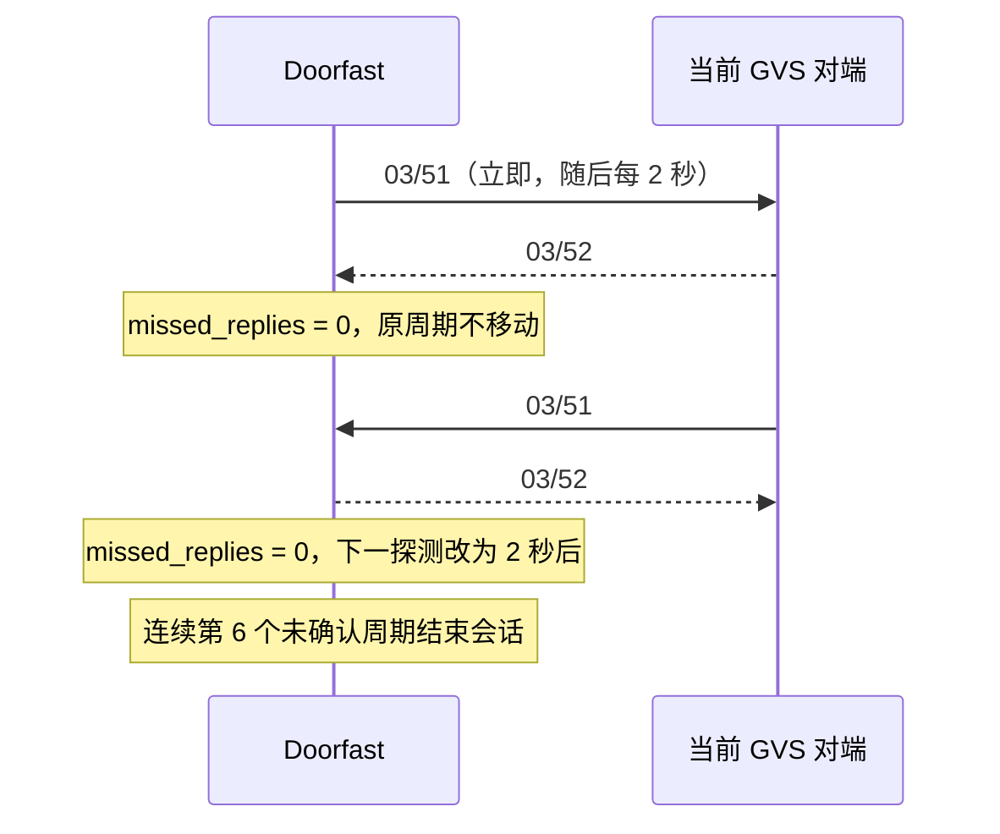

# GVS 通话保活 `03/51` / `03/52`

> 版本：Doorfast `0.1.0-r26`。本模块只产生内存帧，不向现场网络发送。

## 使用已还原的状态规则

MT8157 的 `TalkBackBusiness.startHand` 把丢失计数清零，并注册初始延迟为 0、周期为 2000 ms 的计时器。每次回调先增加计数：计数 1–5 时发送零载荷 `03/51`；计数变为 6 时结束连接，不再发送第六帧。

| 入站消息 | 地址约束 | 计数变化 | 周期变化 | 输出 |
|---|---|---:|---|---|
| `03/51` | 当前对端 → 本机 | 清零 | 从接收时刻重排 2 秒 | 零载荷 `03/52` |
| `03/52` | 当前对端 → 本机 | 清零 | 不变 | 无 |
| 其他或错误地址 | 不接受 | 不变 | 不变 | 无 |



## 离线 API 边界

`df_gvs_handshake_start` 冻结当前会话代次、对端地址和本机地址。`tick` 只生成 `ASK` 意图或在阈值处结束会话；`receive` 只接受完整 42 字节、零载荷且地址匹配的 `03/51`/`03/52`。抢占、挂断、逻辑身份变化或代次变化会取消旧保活，迟到回复不能作用于新会话。

`df_gvs_handshake_action_serialize` 复用公共控制帧序列化器。测试仍使用全零的不透明头字段提供器，因此只证明帧布局和状态逻辑，不证明真实门口机认可。

## 验证

```sh
cd /Users/shenwenjie/Documents/PVE/doorfast
make -B test doorfast
```

`tests/test_gvs_handshake.c` 覆盖五次探测后第六周期断开、两类回复的不同重排行为、精确零载荷帧、错误对端失败原子性、代次变化取消和 64 位时钟上限。

## 守护进程内存事务（r26）

`df_gvs_call_control_step` 在观察到活动会话后的首次 tick 启动保活，同一会话后续 tick 保留周期；代次、对端或本机身份变化使旧状态失效。保活动作转换为有类型的通话命令，使用 `df_gvs_call_dispatch` 和 `df_gvs_call_memory_attempt`，拥有独立单槽位，复用已有三次尝试、250 ms 超时、100 ms 重试和代次取消规则。它不会占用用户接听/挂断槽位，也不会启动接听/挂断确认器。

`df_gvs_call_control_receive` 解析完整公共头后，将 `03/51`、`03/52` 优先交给保活状态机。接收探测产生的回复排队到下一 tick。槽位忙或无法排队时设置 `handshake_action_dropped`，保留已经接受的接收状态和计时进展，不形成无限积压。第六个未确认周期结束本地会话、清除会话期限，并让原确认器和发送事务按失效会话取消。

守护进程记录 `handshake_frame`（`transport=memory`）、`handshake_received`、`handshake_disconnected` 和 `handshake_action_dropped`。这里的内存发送成功、模拟断开均不代表现场设备的网络行为；真实 UDP 仍关闭，头字段继续使用全零占位提供器。被动记录器独立记录原始证据。

`tests/test_gvs_call_control.c` 补充完整五帧生命周期、接收分流和周期、错误对端原子拒绝、槽位占用、三次序列化失败、会话切换与倒退时间测试。本阶段本机 C、ASan/UBSan、CLI、LuCI 和包清单检查通过；x86_64 APK 交叉构建由本次 PR 的 Actions 验证。

后续应为模拟保活增加运行状态查询及回放验收，再评估真实发送前提。
