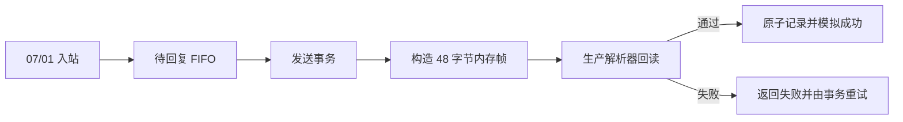

# GVS 内存构帧适配器

Doorfast `r8` 将离线发送事务接入 `07/81` 内存构帧适配器。适配器生成完整 48 字节控制帧，其中公共头占 42 字节、载荷占 6 字节；生成后立即通过生产解析器回读校验，并原子记录最近一次成功结果。运行时不创建发送套接字，也不把帧写入任何网络接口。

## 帧布局

| 偏移 | 长度 | `r8` 内容 | 来源 |
|---:|---:|---|---|
| 0 | 10 | `GVSGVS A5 A5 A5 A5` | 通用控制帧序列化器 |
| 10 | 6 | 请求源逻辑地址 | 待回复对象的目标地址 |
| 16 | 6 | Doorfast 本机逻辑地址 | UCI `gvs_local_address` 解析结果 |
| 22 | 8 | 全零占位 random 字段 | 明确的内存测试提供器 |
| 30 | 8 | 全零占位 encryption 字段 | 明确的内存测试提供器 |
| 38 | 1 | 功能码 `07` | `07/81` 回复类型 |
| 39 | 1 | 操作码 `81` | `07/81` 回复类型 |
| 40 | 2 | 小端载荷长度 `06 00` | 通用控制帧序列化器 |
| 42 | 6 | 请求数据前两字节加四个零 | 待回复对象 |

两个 8 字节全零字段只用于离线结构验证，不代表真实协议的随机码或认证码。日志使用 `header=placeholder` 明确标识这一边界。

## 事务接入



记录包含帧字节、长度、尝试号、完成标识和单调 generation。构帧或回读失败时旧记录保持不变；成功记录的目标、源地址、功能码、操作码、声明长度和载荷必须全部与待回复对象一致。

生产日志只公开长度、尝试号和占位字段类型：

```text
doorfast: event=peer_reply_frame prepared=1 length=48 attempt=1 header=placeholder mode=memory
doorfast: event=peer_reply_tx state=success attempt=1 timed_out=0 mode=simulated
```

## 验证与限制

`tests/test_gvs_memory_sender.c` 使用手工推导的 48 字节期望值验证精确布局、失败原子性、占位字段和“首次构帧失败、第二次重试成功”的事务路径。`tests/run_gvs_vm_udp.py` 将在 `r8` 目标 APK 中要求两个固定 `07/01` 各自产生一条新的内存构帧记录。

本阶段没有网络发送，也没有证明全零占位字段可被真实设备接受。下一阶段应定义可替换的合法公共头提供器边界并开展离线契约测试；只有取得合法字段来源和隔离实机授权后，才能单独验证兼容性。
