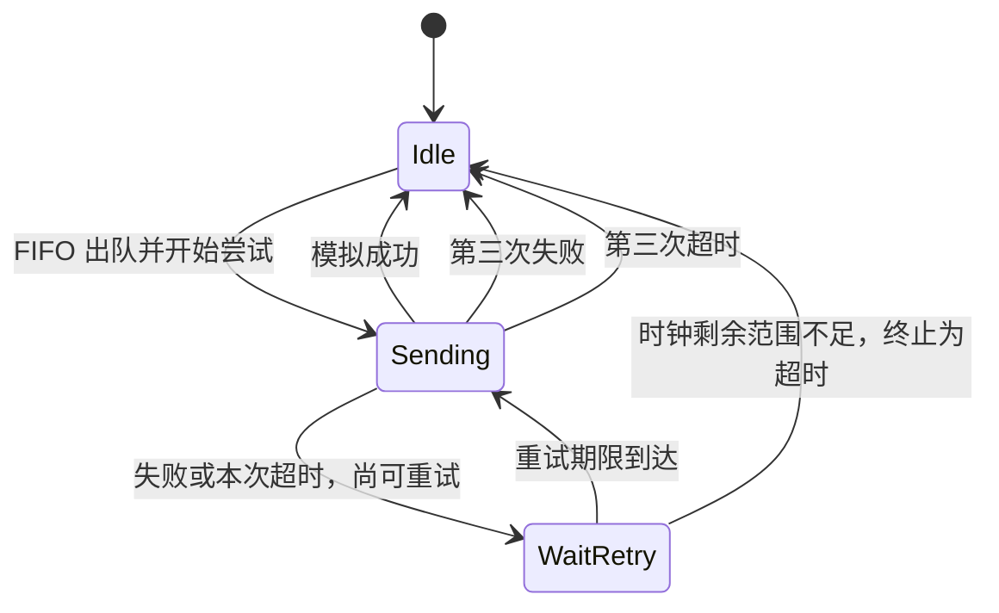

# GVS 离线发送事务

Doorfast `r7` 将 `07/81` 待回复队列接入单事务发送状态机；`r8` 在模拟成功前增加完整内存构帧和回读校验。运行时只验证出队、尝试关联、帧结构、终态和日志；它不创建 UDP 发送套接字，也不向门禁网络发送报文。

## 事务流程



状态机一次只持有一个待回复对象。每个对象内部使用 1–3 的重试序号，每次发送另分配进程生命周期内递增的 64 位完成标识。异步完成必须带回当前标识，因此前一对象或前一次重试的迟到结果不能结束当前尝试。

## 本地策略

| 项目 | `r7` 行为 |
|---|---|
| 并发事务 | 1 个 |
| 最大尝试次数 | 3 次 |
| 单次等待期限 | 250 毫秒 |
| 重试间隔 | 100 毫秒 |
| 立即成功 | 记录 `sending`、`success`，事务回到空闲 |
| 立即失败 | 前两次进入 `retry`，第三次记录 `failed` |
| 无完成结果 | 前两次超时后重试，第三次记录 `timeout` |
| 时间回退 | 拒绝调用，不改变事务或队列 |
| 重试期限无法表示 | 终止为 `timeout`；首次启动期限无法表示则拒绝调用 |

这些数字是 Doorfast 为离线状态机选择的测试与资源策略，不是从旧 APK 推导出的协议时序。接入真实传输前，应以合法互操作证据重新校准发送期限和重试规则。

## 模拟发送边界

生产守护进程在下一次事件循环从 FIFO 队列取出回复对象。`r8` 先构造并回读校验 48 字节内存帧，再把该结果作为模拟发送结果交给事务状态机。每个成功对象记录为：

```text
doorfast: event=peer_reply_frame prepared=1 length=48 attempt=1 header=placeholder mode=memory
doorfast: event=peer_reply_tx state=sending attempt=1 timed_out=0 mode=simulated
doorfast: event=peer_reply_tx state=success attempt=1 timed_out=0 mode=simulated
```

日志不包含目标地址、请求数据或公共头字段。`tests/test_gvs_send_transaction.c` 使用脚本化模拟结果覆盖即时成功、异步失败后成功、三次失败、三次无响应、重试期限、最终超时、跨对象迟到完成、双时钟一致性和接近时钟上限的终态；`r7` 已在目标虚拟机验证固定 `07/01` 经实际抓包入口进入模拟事务，`r8` 验收将进一步检查每个探针均生成新的 48 字节内存帧记录。

## 本地复现

```sh
make clean
make test doorfast peer-sim peer-udp-inject
python3 -B -m unittest tests/test_gvs_peer_udp.py
sh tests/test_gvs_peer_sim_cli.sh
sh tests/test_package_manifest.sh
sh tests/test_main_cli.sh
node tests/test_luci_status.js
```

本阶段没有证明真实门口机接受 `07/81`。`r8` 已接入受控内存构帧适配层；下一阶段应定义可替换的合法公共头提供器边界，并验证字段来源与兼容性。
