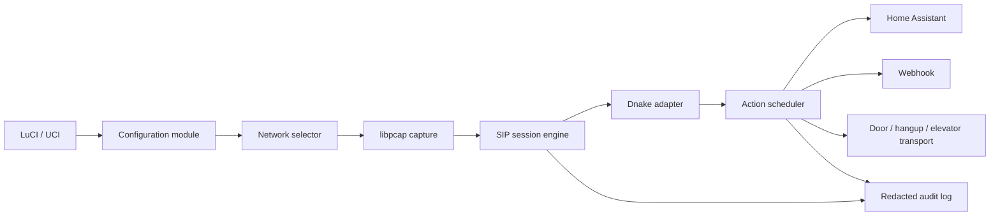

# Doorfast x86 ImmortalWrt design

## Purpose

Doorfast is a clean-room, native x86_64 ImmortalWrt service for integrating a
user-owned Dnake door-entry network with Home Assistant and Webhooks. It
replaces the observed Doorlink service without copying its MIPS executable or
its activation, cloud-deployment, and remote-shell update mechanisms.

The first release supports transparent-mode passive monitoring, notifications,
automatic device discovery candidates, Home Assistant and Webhook delivery,
and automation decisions. Door opening, automatic hangup, and elevator
actions are enabled only after their exact interactions have been verified on
the administrator's own Dnake network. It operates only on network interfaces
explicitly selected by the administrator or discovered from local UCI network
configuration.

## Constraints and non-goals

- Target: x86_64 ImmortalWrt 25.12.1, built with the matching official SDK.
- Runtime language: C17, using the target SDK's `libpcap`, `libuci`, `json-c`,
  OpenSSL, and standard C runtime.
- Supported entry system in the first release: Dnake only.
- Doorfast does not implement, emulate, read, or bypass Doorlink licensing.
- Doorfast does not expose an unauthenticated HTTP control service.
- Doorfast does not execute scripts downloaded from the network.
- Transparent mode is the supported initial deployment mode. Host mode is an
  experimental, separately gated future capability and never replaces an
  existing indoor station without an explicit administrator acknowledgement.
- Video support is a separately gated future capability. It is disabled by
  default and must not degrade the existing door-entry video path.
- Protocol behavior is implemented only after it is documented from static
  artifacts and validated on the administrator's own Dnake test network.

## Architecture

| Component | Responsibility | Dependencies |
|---|---|---|
| Configuration | Load and validate UCI, redact sensitive values | libuci |
| Network selector | Resolve a physical device, VLAN device, or bridge | UCI network/device data |
| Capture | Apply BPF filters and parse Ethernet/IP/UDP/TCP payloads | libpcap |
| SIP session engine | Reassemble dialog state by Call-ID and endpoint | capture output |
| Dnake adapter | Map verified Dnake messages to normalized events/actions | SIP engine, static protocol fixtures |
| Action scheduler | Apply automation, schedule, DND, delay, and allowlist rules | normalized events, UCI |
| Integrations | Deliver selected events to HA REST and Webhook endpoints | OpenSSL, json-c |
| Audit | Record configuration reloads and actions without secrets | syslog / local file |
| Discovery | Turn observed Dnake endpoints into reviewable configuration candidates | SIP session engine, UCI |
| Diagnostics | Test interface, route, and endpoint reachability without changing network state | UCI network data, ICMP/socket probes |

## UCI and LuCI model

The package installs `luci-app-doorfast`, `/etc/config/doorfast`, and a procd
service called `doorfast`. Existing Doorlink concepts are retained where they
describe device behavior:

| Group | Retained settings |
|---|---|
| settings | `enabled`, `brand`, `mode`, `video_forward`, `video_format`, `video_cache` |
| phone | `sip_src`, `sip_dst`, `netmask`, `gateway`, `server`, `family`, `elev` |
| automation | `unlock`, `hangup`, `call_elev` |
| schedule / dnd_schedule | day and time constraints |
| hass | `ipaddr`, `token`, `api` |
| webhook | `whapi`, `whmethod`, `whtype`, `whbody` |
| notification | diagnosis, conversation, and other event switches |

New fields are `capture_interface`, `capture_auto`, and
`capture_promiscuous`. Door endpoints are internally structured as `id`,
optional `credential`, `host`, `port`, `alias`, and `role`; LuCI may import
the familiar `ID[:password]@IP:port` notation but never stores it as an
unvalidated opaque value. Observed endpoints become discovery candidates and
require administrator review before they are added to the allowlist. The
`auth`, `auto_update`, remote deployment, and vendor-cloud-only settings are
intentionally absent.

## Compatibility roadmap

The documentation for the old project is used solely as a behavioral and UX
reference. Doorfast adopts the following roadmap, ordered by safety and
evidence rather than by marketing breadth:

1. **Transparent Dnake monitoring:** selected-interface capture, normalized
   call lifecycle, endpoint discovery candidates, audit, schedule policy, HA,
   and Webhook delivery.
2. **Verified Dnake controls:** door open, hangup, elevator call/floor actions
   only after administrator-owned request/response fixtures and isolated
   device tests are committed.
3. **Network diagnostics:** read-only topology summary, address-overlap
   warnings, route/interface guidance, and per-endpoint reachability tests;
   Doorfast never automatically rewrites routes, firewall rules, or addresses.
4. **Experimental host mode:** a distinct adapter and explicit safety warning;
   it stays disabled unless its registration/call behavior is fixture-tested.
5. **Video:** separately configured RTSP passthrough or controlled relay,
   both disabled by default; authenticated access, bounded storage, and
   regression testing against the original indoor-station video path are
   mandatory.

The project intentionally excludes licensing, activation, third-party cloud
bridges, default credentials, unauthenticated media listeners, automatic
installations, and remote-shell update commands. Stable/beta release channels
remain a GitHub Release selection only; each update requires local
administrator confirmation and hash/signature verification.

## Event and action model

The normalized event states are `IncomingCall`, `Established`, `Hangup`,
`DoorOpened`, `ElevatorRequested`, and `Unknown`. A session is keyed by
Call-ID plus normalized SIP endpoints. Packets that fail syntax validation or
do not match configured endpoints become `Unknown` and never trigger actions.

For matching events, the scheduler evaluates in this order:

1. service enabled and Dnake adapter enabled;
2. interface and configured SIP endpoint allowlists;
3. DND schedule; a matching DND rule permits only the configured hangup path;
4. auto-unlock schedule;
5. `unlock`, `call_elev`, and `hangup` delay values;
6. observed action response and bounded retry policy.

`-1` disables an automation action; `0` executes it immediately; values `1`
through `9` schedule the action after that many seconds. An action is never
replayed indefinitely. Every decision records the session identifier, matched
rule, target alias, result, and timestamp, with credentials removed.

## Dnake adapter boundary

The adapter has two narrow interfaces: decoded session input and transport
output. It owns Dnake-specific SIP/XML/JSON templates and knows no HA,
Webhook, LuCI, or update details. New protocol fields are added only with a
captured fixture and a matching parser test. The initial fixture collection
contains a call, answer, hangup, permitted door-open command, and permitted
elevator command from a user-owned device.

## Integrations

Home Assistant uses a configured HTTPS endpoint and an explicitly supplied
Bearer token. Webhooks support POST or GET, configured media type, and a
templated body. The supported templates are explicit normalized fields such as
event type, timestamp, target alias, and session identifier; arbitrary raw
packet substitution is prohibited. TLS certificate validation remains enabled.
Both integration targets use a bounded queue; unreachable targets are retried
a finite number of times and cannot block local door-session handling.

## Packaging and updates

The source repository is `https://github.com/jieinfo/doorfast`. Each GitHub
Release publishes an x86_64 APK, a SHA-256 manifest, and a detached signature.
Doorfast ships the administrator-configured public verification key and checks
the release manifest, package hash, and signature before invoking the local
APK installation helper.

LuCI may check a stable or beta release channel. Automatic checks are allowed
only when enabled; automatic installation is not. Installation requires an
administrator confirmation and uses a local privileged helper exposed only
through LuCI/rpcd authorization. A failed download, hash check, signature
check, or APK operation leaves the installed package and UCI configuration
unchanged.

## Error handling and security

- Missing capture interfaces leave the daemon running in a waiting state.
- Invalid packets, unsupported Dnake messages, and failed actions create
  redacted audit events but no automatic fallback action.
- Logs never include Home Assistant tokens, Webhook secrets, SIP credentials,
  full activation-like values, or raw packet bodies by default.
- The daemon has no Internet destination unless HA, Webhook, or update checks
  are explicitly configured.
- A local HTTP server is not part of the service.
- Video, if later enabled, is exposed only through authenticated LuCI/rpcd
  authorization or a separately authenticated local service; it never opens
  legacy unauthenticated playback or RTSP ports by default.

## Test strategy and acceptance criteria

| Test layer | Proof |
|---|---|
| UCI parser | valid configuration loads; invalid values produce no action-capable configuration |
| Packet parser | anonymized PCAP fixtures map to expected normalized events |
| Session engine | Call-ID correlation, timeout, DND, and schedule tests are deterministic |
| Dnake adapter | each supported call, hangup, open, and elevator message has a golden fixture |
| Integration | HA/Webhook mock tests verify TLS failures and bounded retries |
| Package | SDK-built APK installs, starts with procd, and survives a config reload |
| Device test | user-owned isolated Dnake network verifies all active actions with audit evidence |
| Discovery | observed endpoint remains a candidate until an administrator accepts it |
| Diagnostics | overlap warnings and reachability results never alter interface, route, or firewall state |
| Video (future) | disabled-by-default behavior, authorization, storage limit, and indoor-station regression evidence |

The first release is accepted only when every fixture test passes, the APK
installs on a clean x86_64 ImmortalWrt 25.12.1 image, and each active action
has been exercised on an isolated user-owned Dnake environment.
