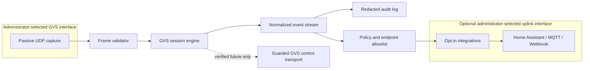
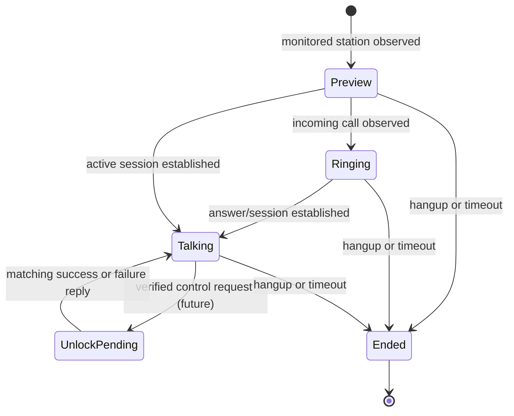

# Doorfast GVS architecture

## Purpose and scope

Doorfast is a clean-room native x86_64 ImmortalWrt service for a user-owned
GVS door-entry network. It provides a safe bridge from verified GVS UDP
observations to normalized local events and, later, opt-in Home Assistant,
MQTT, or Webhook integrations.

This document supersedes the Dnake/SIP protocol path as Doorfast's primary
architecture. The existing Dnake-oriented foundation remains historical
compatibility work; it is not used by the GVS runtime.

The first GVS milestone is passive: it accepts only administrator-selected
interfaces and turns validated, observed traffic into events. It neither emits
GVS packets nor controls a physical door.

## Safety boundary

- Doorfast supports x86_64 ImmortalWrt 25.12.1 and is built with its matching
  official SDK.
- The administrator explicitly selects interfaces; Doorfast never assumes
  `eth0`, `wlan0`, a default bridge, or a default route.
- Doorfast does not create, modify, or delete interfaces, routes, addresses,
  VLANs, bridges, firewall rules, or DNS configuration.
- Raw PCAPs, media, real IP addresses, device identifiers, credentials, and
  dynamic session material are private evidence and are never committed.
- The service ships disabled. A missing selected interface produces a redacted
  diagnostic event and no fallback capture.
- Old Doorlink activation, vendor-cloud deployment, remote shells, and update
  mechanisms are outside scope.

## Interface and configuration model

`gvs_interface` is required whenever GVS processing is enabled. It names the
physical device, VLAN device, bridge, bond, or other local interface that
carries the door-entry network. `uplink_interface` is optional and selects the
egress interface for integrations and update checks. If it is absent,
integration traffic uses the operating system's existing routing decision;
Doorfast does not alter that decision.

```uci
config gvs 'main'
  option enabled '0'
  option gvs_interface 'br-door'
  option uplink_interface 'br-lan'
  option passive_only '1'
  option capture_promiscuous '0'
```

The names above are examples, not defaults. Validation checks only that the
chosen interfaces exist and are administratively usable; it never discovers an
interface and silently adopts it. A separate endpoint allowlist contains
administrator-approved GVS device aliases and addresses.

## Architecture



| Component | Responsibility | Initial state |
|---|---|---|
| UCI configuration | Validate interfaces, endpoint aliases, passive mode, and integration settings | Implement first |
| Passive capture | Capture only configured GVS UDP ports on `gvs_interface` | Implement first |
| Frame validator | Validate the `GVSGVS` envelope, fixed marker, length, addresses, and message family | Implement first |
| Session engine | Correlate call, preview, answer, talk, unlock result, and hangup observations | Implement first |
| Media metadata parser | Identify G.711 audio and fragmented JPEG/MJPEG metadata without storing media | Later, passive only |
| Integrations | Publish redacted normalized events through configured interfaces | After event fixtures |
| Control transport | Create fresh, state-bound requests and verify replies | Future, disabled by default |

## Observed protocol contract

The evidence set establishes a UDP family with ports 8300 through 8304 and a
fixed `GVSGVS` envelope followed by a fixed marker. Frame addresses and
per-session fields are treated as opaque bytes until their semantics are
independently proven. Doorfast therefore parses only the documented envelope,
declared lengths, direction, and message-family fields in the first milestone.

The normalized lifecycle is:



Initial events are `StationObserved`, `PreviewStarted`, `IncomingCall`,
`SessionEstablished`, `MediaObserved`, `UnlockResultObserved`, `Hangup`, and
`UnknownFrame`. Events include a redacted endpoint alias, monotonic observation
time, protocol direction, and a bounded session identifier. They never expose
raw packet bytes by default.

## Control policy for a later milestone

Doorfast will not replay captured frames. Before any control transport exists,
the following evidence gate must be satisfied for each action independently:

1. An anonymized request and matching response fixture from an owned test
   system establishes frame layout and session binding.
2. A parser test and state-machine test prove that stale, mismatched, malformed,
   or unallowlisted frames cannot select a target.
3. The administrator enables the action and names a specific target alias in
   the allowlist.
4. A current valid session is present, a fresh request is constructed, and the
   expected response is validated within a bounded timeout.
5. The action is written to the redacted audit log; retries are finite and no
   fallback target is attempted.

The first control-capable release must default to disabled controls and remain
operable in passive-only mode.

## Data handling and failure behavior

Captured packet payloads are processed in memory and discarded after parsing.
Test fixtures are synthetic and use reserved documentation addresses and
invented identifiers. Video and audio payloads are not persisted. Integration
queues are bounded; a failed integration cannot block capture or session state.

Invalid frames, an unavailable interface, unconfigured endpoint, unknown
message family, session timeout, and integration failure produce redacted audit
records. None trigger a door action, route change, interface selection, or
packet replay.

## Acceptance criteria

| Area | Required proof |
|---|---|
| Configuration | Tests reject empty, missing, or unavailable selected interfaces and accept arbitrary valid interface names |
| Passive parser | Synthetic fixtures for all observed message families produce deterministic events |
| Session engine | Preview, incoming call, answer, timeout, hangup, and observed unlock result transitions are deterministic |
| Privacy | Tests confirm logs and integration payloads omit raw addresses, session bytes, media, and secrets |
| Package | An APK built with the official x86_64 SDK starts disabled and does not capture until configured |
| Controls | No outbound GVS packet implementation exists until its separate evidence gate and owned-system verification are complete |

## Implementation order

1. Replace protocol-facing documentation and configuration vocabulary with GVS
   and the explicit dual-interface model.
2. Add synthetic GVS envelope fixtures, a frame validator, and a passive
   session state machine using test-driven development.
3. Add UCI validation, capture filters, and redacted audit events.
4. Add opt-in event integrations after event data is stable.
5. Consider media metadata and individually gated control actions only when
   their fixture and owned-system evidence requirements are met.
