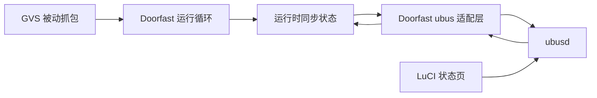

# Doorfast ubus 与 LuCI 状态页设计

日期：2026-09-08
状态：已由用户确认，等待实现计划

## 目标与范围

本阶段在 ImmortalWrt 25.12.1 x86_64 上为 Doorfast 增加只读的本地状态入口，并用独立的 `luci-app-doorfast` APK 显示当前同步状态。页面用于观察和诊断，不修改 UCI 配置、不触发门禁动作、不启用同步字段，也不向 GVS 网络发送数据。

交付范围只有两个功能：

1. Doorfast 守护进程注册 `doorfast` ubus 对象和无参数 `status` 方法。
2. LuCI 在“服务 → Doorfast”显示服务状态和脱敏同步状态，并自动刷新。

配置编辑、主动控制、在线升级、媒体和通知不属于本阶段。现有被动抓包、同步状态机和运行时状态快照保持唯一事实来源。

## 选择的架构

Doorfast 直接连接系统 ubus，不使用状态文件或 rpcd 代理。现有抓包循环保留；每次抓包返回或等待分片结束时，以非阻塞方式检查 ubus 文件描述符并处理已到达请求。抓包超时仍为 1000 毫秒，因此正常状态查询的最坏调度延迟为约一秒。

本阶段不把全部运行服务迁移到 uloop。完整 uloop 改造需要同时改变抓包、信号、计时与网络恢复，超出只读状态页范围。官方 libubus 提供不使用 uloop时处理事件的 `ubus_handle_event()`，本设计使用该接口：<https://github.com/openwrt/ubus/blob/master/libubus.h>。



## 组件边界

### 守护进程 ubus 适配层

新增 `src/runtime_ubus.h` 与 `src/runtime_ubus.c`。该模块只负责连接、对象注册、请求转发、非阻塞处理、断线标记和有限重连；它不读取协议结构内部字段，也不拥有同步状态。

适配层接收一个状态提供器回调。运行服务把现有 `df_gvs_runtime_sync_status()` 的结果通过该回调提供给 ubus。ubus 响应直接从结构化快照生成 blob 字段，不解析或转发 JSON 字符串，避免数值和布尔类型退化为文本。

公开生命周期接口固定为：

```c
typedef int (*df_runtime_status_provider_fn)(
    struct df_gvs_runtime_sync_status *status, void *context);

int df_runtime_ubus_start(struct df_runtime_ubus *service,
                          df_runtime_status_provider_fn provide_status,
                          void *context, uint64_t now_ms);
int df_runtime_ubus_process(struct df_runtime_ubus *service,
                            uint64_t now_ms);
void df_runtime_ubus_stop(struct df_runtime_ubus *service);
```

本机开发构建不要求安装 libubus：未定义 `DF_WITH_UBUS` 时编译无外部副作用的替代实现。ImmortalWrt 软件包构建定义该宏并链接 `libubus`、`libubox` 和 `libblobmsg-json`。实际 ubus 注册和目标库兼容性由 SDK 构建验证，纯状态映射继续由本机 C 测试验证。

### 运行循环接入

`src/runtime_service.c` 在同步状态机启动后初始化 ubus。每次 `df_capture_next()` 返回后先推进同步和会话计时，再处理待决 ubus 请求。捕获接口重连期间的 250–4000 毫秒等待被拆成不超过 250 毫秒的片段，每片之间处理 ubus，使页面仍能看到 `down` 状态。

ubus 启动失败不终止门禁核心。模块记录脱敏错误并按 5 秒固定间隔重连；任一时刻最多保留一个连接和一个 `doorfast` 对象。停止服务时先注销对象并释放 ubus 上下文，再释放抓包资源。

### LuCI 软件包

新增独立目录 `package/luci-app-doorfast/`，生成架构无关的 `luci-app-doorfast` APK，并依赖 `doorfast`、`luci-base` 和 `rpcd`。它安装：

- `/usr/share/luci/menu.d/luci-app-doorfast.json`
- `/usr/share/rpcd/acl.d/luci-app-doorfast.json`
- `/www/luci-static/resources/view/doorfast/status.js`

页面使用 LuCI JavaScript RPC 调用 ubus，并每 5 秒刷新一次。官方 LuCI 示例采用相同的 JavaScript 视图、RPC 和 ACL 分层：<https://github.com/openwrt/luci/tree/master/applications/luci-app-example>。

## ubus 数据契约

调用方式：

```sh
ubus call doorfast status '{}'
```

成功响应固定为：

```json
{
  "running": true,
  "mode": "passive",
  "sync": {
    "phase": "periodic",
    "role": "follower",
    "version": 23,
    "periodic_misses": 0,
    "online_peers": 1,
    "registered_adapters": 2,
    "enabled_adapters": 0,
    "last_opcode": 3,
    "last_handled": true,
    "last_accepted": true,
    "last_rejected": false,
    "resend_local": false
  }
}
```

字段约束：

| 字段 | 类型 | 规则 |
|---|---|---|
| `running` | boolean | ubus 对象存在并成功读取快照时为 `true` |
| `mode` | string | 本阶段固定为 `passive` |
| `phase` | string | `down`、`wait_sync`、`sync_ask`、`sync_choose` 或 `periodic` |
| `role` | string | `down`、`starting`、`maintainer` 或 `follower` |
| 版本和计数 | unsigned integer | 直接来自运行时快照，不使用负数或字符串 |
| 最近接收结果 | integer/boolean | 尚未观察同步帧时操作码为 0、布尔值均为 `false` |

响应绝不包含六字节逻辑地址、IP、接口名、同步适配器键名、适配器值、认证字段或原始报文。未知枚举值不返回 `unknown` 成功响应，而是以 ubus `UNKNOWN_ERROR` 拒绝，避免界面把损坏状态显示为正常。

## 页面行为

页面分为三块：服务、在线同步、最近同步报文。角色用普通文本和 LuCI 状态色显示；`maintainer`、`follower` 与 `starting` 不翻译成“主机已完成”，避免混淆离线选举状态与真实设备验收。

页面加载或刷新失败时显示“Doorfast 服务未运行或状态接口不可用”，保留最后成功值但明确标记为陈旧。连续刷新不会写 UCI、调用 init 脚本或触发通知。页面只依赖只读 ACL：

```json
{
  "luci-app-doorfast": {
    "description": "Read Doorfast runtime status",
    "read": {
      "ubus": {
        "doorfast": ["status"]
      }
    }
  }
}
```

## 错误处理与安全边界

- ubusd 不可用：核心服务继续运行，5 秒后重试连接。
- 状态提供器失败：该次调用返回 ubus `UNKNOWN_ERROR`，不发送部分响应。
- ubus 断线：销毁旧上下文并重新注册，禁止重复对象。
- 捕获接口失效：同步状态机进入 `down`，ubus 继续响应；恢复后显示重新上线阶段。
- 守护进程停止：ubus 对象消失，LuCI 显示不可用，不从磁盘加载伪实时状态。
- ACL 只授予 `doorfast.status`；没有写权限、通配方法或 shell 执行权限。
- ubus 返回值和 LuCI DOM 都不含敏感同步字段；当前敏感适配器是否启用只能显示总数。

## 构建与测试

本机测试采用测试驱动方式覆盖：状态快照到 ubus 响应模型的精确类型、所有阶段和角色映射、状态提供器失败、无 ubus 构建以及敏感字段不出现在响应中。LuCI 页面使用固定合成响应验证字段渲染、错误提示和陈旧状态；JavaScript 至少执行语法检查。

APK 清单测试验证两个软件包目录、只读 ACL、菜单、视图、依赖、`DF_WITH_UBUS`、目标链接库和 SDK 复制路径。GitHub Actions 安装 LuCI feed 依赖，分别构建 `doorfast` 与 `luci-app-doorfast`，并要求两个 x86_64/架构无关 APK 都作为产物出现。

验收命令包括：

```sh
make -B test doorfast
sh tests/test_main_cli.sh
sh tests/test_package_manifest.sh
python3 -B -m unittest discover -s tests -p 'test_gvs_preemption_model.py'
```

目标 SDK 还必须成功完成：

```sh
make package/doorfast/compile V=s
make package/luci-app-doorfast/compile V=s
```

没有 ImmortalWrt 运行实例时，只能声明构建和离线契约通过，不能声明 ubus 实机注册、LuCI 页面运行或主机模式验收完成。

## 完成标准

本阶段完成需要同时满足：

1. 所有本机测试、内存安全检查和 APK 清单测试通过。
2. ImmortalWrt 25.12.1 x86_64 SDK 生成两个 APK。
3. 在目标系统调用 `ubus call doorfast status '{}'` 返回上述类型稳定的脱敏结构。
4. LuCI 页面安装后可在服务菜单打开，自动刷新，并正确显示服务停止、启动、选举中、维护者和跟随者状态。
5. 网络捕获中断时页面保持可用，且 Doorfast 不产生新增 GVS 发包。
