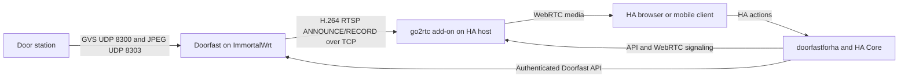

# Doorfast HA WebRTC Media Design

Status: approved design

Date: 2026-09-17

## Goal

Add an opt-in Doorfast media path. ImmortalWrt receives private GVS control and video, confirms an active door-station preview, reconstructs JPEG frames, encodes H.264, and publishes one RTSP stream to the go2rtc add-on on Home Assistant. HA owns the Camera entity, WebRTC viewing, user authentication, dashboards, notifications, and all user controls.

HA must not decode GVS frames, route packets on the building network, or send GVS frames directly. Doorfast remains the exclusive GVS control endpoint.

## In Scope

- HA opening the Doorfast live camera or calling `doorfast.start_monitor` starts a preview.
- Doorfast sends monitor request `03/04`, accepts only a matching `03/84`, and admits matching UDP/8303 frames.
- Doorfast produces H.264 and sends RTSP/TCP to HA-hosted go2rtc.
- HA exposes the source through its native WebRTC Camera API.
- Doorfast controls answer, hangup, unlock, and elevator through its existing authenticated API.

The initial release excludes outbound formal calls, WebRTC audio, microphone backchannel, recording, cloud relay, TURN, and unverified parallel GVS preview sessions. Doorfast does not open RTSP or WebRTC listeners on the building-facing GVS interface.

## Protocol Evidence

The active monitor implementation is based on vendor static material plus `mt8157/pcap/gvs-active-three-20260907.pcap`, and is distinct from incoming-call support.

| Observation | Verified evidence |
| --- | --- |
| Monitor request | Indoor host sends GVS `03/04` on UDP/8300. |
| Request body | `02 20 6f 00 20 6e 1e`. |
| Retry cadence | About one second between requests. |
| Positive confirmation | Station returns `03/84` with observed body `1e 00 01`. |
| No confirmation | `03/50` appears and is treated only as non-confirming. |
| Video start | UDP/8303 JPEG fragments begin about 0.74 seconds after a captured `03/84`. |
| Stop | `03/02`, commonly body `00`, and `03/82` confirmation appear in captures. |

Vendor material describes `03/04 -> 03/84` as monitoring. It is separate from formal answer `03/03 -> 03/83`. Preview never automatically sends `03/03`, `03/55`, audio, unlock, or elevator actions.

## Topology



Doorfast owns GVS state, route matching, frame admission, JPEG reconstruction, encoding, and publication. go2rtc owns RTSP ingress, WebRTC transport, and viewer fan-out. HA owns user access, entity state, services, and signaling. The browser connects only to HA-hosted go2rtc, not to ImmortalWrt.

## Preview State

Doorfast adds a monitor state machine independent of normal incoming calls:

```text
idle -> requesting -> awaiting_video -> publishing -> viewing -> stopping -> idle
                         \-> failed -> stopping -> idle
```

`requesting` sends bounded `03/04` retries with the active-host header provider. The target requires a configured station logical identity and a recently observed route from `07/06 -> 07/86`; manually configured routing is explicit fallback only.

`awaiting_video` begins after a matching `03/84`. Station identity, local identity, source IP, active generation, and state must all match. It fails if no complete valid JPEG arrives before the configured deadline.

`publishing` begins only after the first valid JPEG starts an encoder and its RTSP publication connects. `viewing` additionally requires an active HA WebRTC session. Any late packet or event cannot affect a newer generation.

Doorfast rejects preview while a call rings or talks. A subsequent incoming call stops preview, encoding, and publication before the regular incoming-call path continues. Preview never preempts an active call in the first release.

## Capacity

LuCI exposes a user-selected encoder capacity. Doorfast calculates effective capacity:

```text
effective capacity = min(user limit, resource limit, protocol-verified limit)
```

The user limit is `auto` or 1 through 4. Resource checks include free memory, configured reserve, encoder availability, and recent failure backoff. The initially verified protocol limit is one GVS preview. The slot manager supports more, but LuCI reports higher counts unavailable until multi-session GVS routing is separately implemented and accepted in the field.

Multiple HA pages or phones viewing the same station consume one Doorfast encoder slot. go2rtc distributes one H.264 input to every viewer.

## Encoding

Doorfast attaches the publisher where its runtime receives a complete, admitted JPEG, before it updates the in-memory cache and latest snapshot. It must not repeatedly read `/tmp/doorfast-latest.jpg`, because that cache may skip frames and has no reliable timestamp source.

Each slot owns a bounded nonblocking JPEG queue. GVS reception never waits for encoding. A full queue discards the oldest unencoded frame and records a counter. This prevents encoding stalls from blocking UDP/8300 control or UDP/8303 reassembly.

Doorfast starts `ffmpeg` using `fork` and `exec` with an argument vector. It never builds a shell command. Frame input is a private root-only pipe or FIFO. Initial output is H.264 `yuv420p`, Baseline, no B-frames, low-latency mode, source size (normally 480x640), 8-10 fps, 800 Kbps target, 1.2 Mbps ceiling, one-second IDR, repeated SPS/PPS, and RTSP/TCP.

`auto` uses QSV when usable, then VAAPI, then software H.264. An explicitly selected unavailable encoder fails closed. Source resolution changes restart the publication; Doorfast never changes RTP dimensions in an active media session.

## go2rtc Contract

The official HA go2rtc add-on pre-creates an empty stream because external RTSP `ANNOUNCE`/`RECORD` ingest requires an existing destination:

```yaml
streams:
  doorfast_preview:

rtsp:
  listen: ":8554"
  username: doorfast
  password: ${DOORFAST_RTSP_PASSWORD}
  default_query: "video=h264"
```

Doorfast pushes a single stream to `rtsp://doorfast:<secret>@<ha-lan-address>:8554/doorfast_preview`.

Doorfast stores only separately validated username and password in `/etc/doorfast/media-credentials` with mode `0600`. No password, complete RTSP URL, SDP, ICE candidate, or raw GVS payload appears in status, UI, logs, exports, or support bundles.

Doorfast can reach only HA `8554/TCP`. It cannot reach go2rtc API `1984/TCP`; that API is authenticated and restricted to HA. HA viewers reach `8555/TCP+UDP`. No go2rtc, RTSP, or WebRTC service is reachable from the building-facing GVS network.

## Home Assistant

`doorfastforha` becomes push-first for monitor lifecycle. Doorfast sends authenticated events named `monitor_requested`, `monitor_confirmed`, `monitor_media_ready`, `monitor_publishing`, `monitor_failed`, `monitor_stopped`, and `monitor_preempted`.

Every event includes schema version, event id, generation, monotonic status revision, timestamp, and a filtered status snapshot. HA validates and de-duplicates it, then updates `DataUpdateCoordinator` directly. A low-frequency reconciliation read remains for recovery after network or process restart.

Doorfast adds these authenticated endpoints:

| Endpoint | Role |
| --- | --- |
| `POST /api/v1/monitor/start` | Request preview for a configured station. |
| `POST /api/v1/monitor/stop` | Stop only the supplied current generation. |
| `GET /api/v1/monitor/status` | Read monitor and publisher state. |

The HA integration adds `doorfast.start_monitor` and `doorfast.stop_monitor`, translated buttons, and a streaming Camera entity. Its native `CameraWebRTCProvider` uses opaque `doorfast://<entry>/preview`, waits for Doorfast `publishing`, and proxies HA offer and ICE candidate messages to HA-local go2rtc `/api/ws?src=doorfast_preview`. It forwards responses through HA's provider contract and tracks session lifecycle by Doorfast generation.

The existing JPEG endpoint remains thumbnail and fallback. When the final viewer disconnects, HA waits a configurable grace period and stops preview only if no provider sessions remain.

## LuCI and Packages

Base `doorfast` remains usable without media dependencies. Optional `doorfast-media` adds monitor routing, queues, encoder supervisor, RTSP publisher, media configuration, credentials management, UBus methods, CGI endpoints, and LuCI media controls. `luci-app-doorfast` detects whether the optional package is installed.

The media tab extends the existing strict `config gvs 'main'` section:

| Option | Default | Valid values |
| --- | --- | --- |
| `media_enabled` | `0` | Requires active host and valid station configuration. |
| `media_go2rtc_host` | empty | Host or IP only. |
| `media_go2rtc_port` | `8554` | 1-65535. |
| `media_stream_name` | `doorfast_preview` | ASCII letters, digits, `_`, `-`. |
| `media_rtsp_username` | `doorfast` | Bounded ASCII. |
| `media_encoder` | `auto` | `auto`, `software`, `vaapi`, `qsv`. |
| `media_resolution` | `source` | Source, 480x640, 360x480, 240x320. |
| `media_fps` | `10` | 5, 8, 10, 12, 15. |
| `media_bitrate_kbps` | `800` | 256-2000. |
| `media_profile` | `baseline` | `baseline`, `main`. |
| `media_max_encoders` | `auto` | `auto`, 1-4. |
| `media_min_free_kib` | `393216` | 128-1024 MiB. |
| `media_preview_timeout` | `120` | 15-600 seconds. |
| `media_first_frame_timeout` | `8` | 2-30 seconds. |
| `media_publish_retries` | `3` | 0-5. |
| `media_overload_policy` | `reject_new` | `reject_new`, `stop_oldest_preview`. |
| `media_diagnostics` | `1` | Boolean. |

LuCI writes passwords with a privileged RPC action. The saved page only reports `set` or `not set`; blank input preserves an existing password until an explicit clear operation. Status reports effective capacity, active slot, state, generation, source route, encoder, frame count, queue drops, dimensions, bitrate, publication state, and a redacted failure.

## Failures and Cleanup

| Code | Trigger | Local action |
| --- | --- | --- |
| `capacity_exhausted` | No effective free slot. | Reject or apply configured preemption. |
| `monitor_timeout` | No matching `03/84`. | Stop; no encoder starts. |
| `monitor_unconfirmed` | Station response is not confirmation. | Stop and retain opcode only. |
| `first_frame_timeout` | Confirmed monitor has no valid JPEG. | Bounded stop and clean slot. |
| `source_mismatch` | Route, identity, or generation mismatch. | Drop and count. |
| `encoder_unavailable` | Requested encoder cannot start. | Fail closed. |
| `encoder_exited` | Unexpected encoder exit. | Retry within policy or clean slot. |
| `rtsp_publish_failed` | Route, auth, or ingest fails. | Stop encoder and report safe failure. |
| `call_preempted` | Incoming call begins. | Stop preview first. |
| `stop_timeout` | No matching `03/82`. | End local media; mark remote stop unconfirmed. |

Every exit closes input, reaps the child, removes private IPC, invalidates generation cache, and removes the RTSP producer. The configured empty go2rtc stream remains with zero producers.

## Verification

Unit tests cover strict media UCI parsing, duplicate rejection, captured `03/04` construction, route and generation admission, confirmation and timeout states, queue loss, resource limits, child cleanup, authenticated bridge methods, HA event de-duplication, WebRTC offer and candidate forwarding, grace timeout, and credential non-disclosure.

ImmortalWrt VM tests install actual APKs and use a peer simulator for `07/86`, `03/84`, malformed traffic, JPEG fragments, stale traffic, and incoming-call preemption. An RTSP ingest fixture verifies H.264 publication, clean stop, and no persistent network or firewall changes.

HA/go2rtc tests use the pre-created empty `doorfast_preview` stream. They verify RTSP authentication, one producer for multiple viewers, one Doorfast encoder slot, WebRTC provider cleanup, event-driven updates, and JPEG fallback.

Field acceptance requires each independent fact: matching `03/84`; accepted JPEG frames; one H.264 producer; HA browser and mobile WebRTC viewing with one encoder; cleanup after final viewer; incoming-call preemption; and a ten-minute run that preserves configured free memory and responsive call control. Each run retains anonymized pcap, Doorfast status, redacted diagnostics, go2rtc producer and consumer state, and HA logs.

## Release Gate

Media remains default-disabled. Release requires VM, HA/go2rtc, and full field acceptance for the target station model and firmware. Multiple station preview, outgoing calls, WebRTC audio, and universal GVS compatibility remain outside this release until independently evidenced and accepted.
